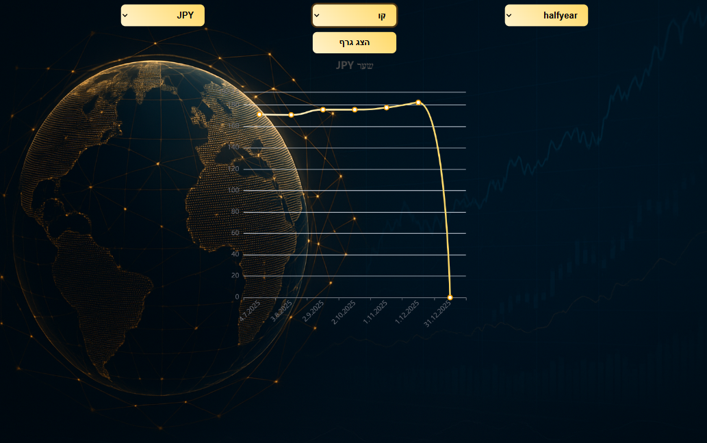
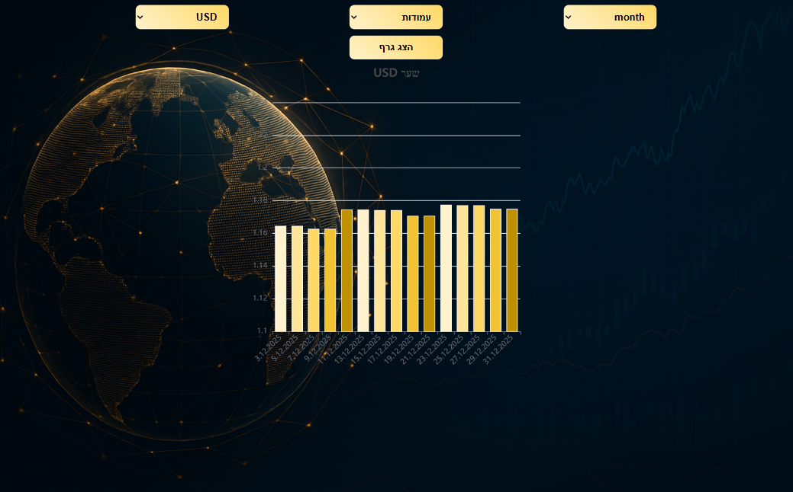
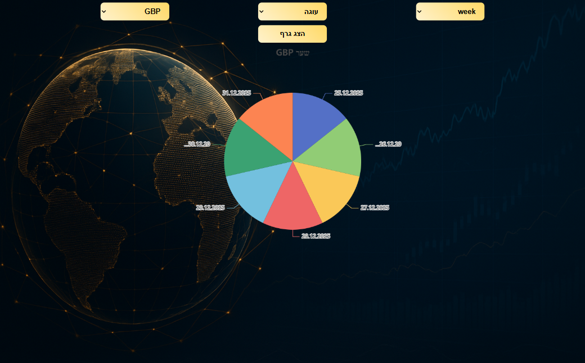

# CoinsGraphsProject

CoinsGraphsProject is a full-stack educational web application that visualizes currency data using multiple chart types, time ranges, and user-selected currencies.

The project was built to practice real-world client–server communication, data visualization, and integration with an external API, while providing an interactive way to explore financial data.

---

## 🧭 Project Overview

The application enables users to view and compare currency values using dynamic charts, based on:

- Selected currency (from 4 available currencies)
- Selected time range (week, month, half year, year)
- Selected chart type (Line, Column, Pie)

The backend retrieves up-to-date currency data from an external API and exposes it to the client via a structured REST API.

---

## 📊 Screenshots / Demo

Charts update dynamically according to user selections:

---

## ✨ Main Features

- Multiple chart types with dynamic updates
- Support for 4 different currencies
- Time range filtering (week, month, half year, year)
- Interactive UI driven by user selections
- Clear separation between frontend and backend responsibilities
- Integration with an external currency data API

---

## 🛠 Technologies Used

### Frontend (Client)
- Angular
- TypeScript
- Chart library for data visualization

### Backend (Server)
- C# (.NET)
- REST-style API
- External currency rates API integration
- Server-side data processing and formatting

---

## 🗂 Project Structure

- `server/` – .NET backend  
  - Run path: `server/CoinsProject2`
- `client/` – Angular frontend

---

## 🧠 What I Learned & Key Challenges

- Designing a scalable client–server architecture for data visualization
- Integrating external APIs and adapting their data formats for frontend usage
- Implementing time-based data filtering on the server side
- Building reusable and dynamic chart components in Angular
- Managing application state based on user-driven selections
- Maintaining clear separation of concerns between business logic and UI
- Working with asynchronous data flows across the full stack

---

## ▶ Running the Project Locally

### Backend (Server)

    cd server/CoinsProject2
    dotnet run

### Frontend (Client)

    cd client
    ng serve

The application will be available locally once both the server and client are running.

---

## 📌 Project Status & Future Improvements

The project currently runs locally and serves as a full-stack portfolio project.

Potential future improvements include:
- Supporting additional currencies
- Adding more chart types
- Improving UI/UX, including mobile responsiveness
- Optimizing data fetching and performance (e.g., caching API responses and reducing redundant requests)
- Deploying the application

---

## 📝 Notes

This project demonstrates practical full-stack development skills, including REST API design, external API integration, and data visualization using C# and Angular.  
It reflects real-world considerations such as performance, responsiveness, separation of concerns, and interactive user-driven interfaces.
